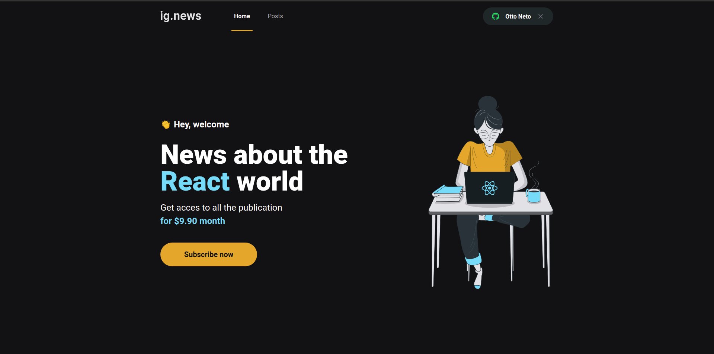

# Inicinado a aplicacao

* Ira precisar de uma conta no
    * Prismic
    * Stripe
    * FaunaDb
* Depois adicionar as chaves em um arquivo .env.local. 
* No arquivo .env.example que se encontra no projeto estao todas as variaveis utilizadas no projeto
* Basta copiar para o .env.local e adicionar suas credencias.

# Sobre
 * Projeto criado pela rocketseat para ensinamentos do nextjs juntamento com alguns frameworks de autenticacao, banco de dados serveless, CMS , entre outras funcionalidades.

# NextJs
- Feito para desenvolvimento front-end web.

- Framework para React, onde: 
    - React é uma biblioteca para construção de interfaces.
- Adiciona varias funcionalidades dentro do React quando está em produção

- Focado em dois pontos
    - Performasse
    - Indexação,  o Browser não precisa esperar o javascript do React tradicional terminal para realizar alguma ação, com o Next, o Browser não precisa carregar o javascript.

# Quais os frameworks

FrameWork  | Conceito
---------  | -------
typescript | tipar o js
sass       | estilizacao
stripe     | pagamentos
faunadb    | Serveless
next-auth  | Autenticacao ao lado do front (GITHUB)
----------------------

# Stripe
- Permite a indivíduos e negócios receber pagamentos por internet.

# SPA - Single page aplication

### Como funciona

1. Browser:
    * Encarregado de fazer todo o carregamento da aplicacao
    * Solicita ao codigo react que envie toda a pagina montada

2. React:   
    * O browser solicita ao react toda a estrutura, interface e consumo da api
    * Envia ao back-end uma requisicao e o back devolve uma resposta em JSON

3. Por fim:
    * O react devolve ao Browser toda a estrutura montada.

# SSR - Server Side Rendering

### Como funciona

1. Browser:
    * Solicita ao servidor Nextjs toda a aplicacao preparada.

2. NextJs:   
    * Solicita ao react que prepare toda a estruturacao (Consumo de api e a interface)
    * Depois que o react montar toda a interface, o mesmo devolve toda a estrutura da pagina ao Next
    
3. Por fim:
    * O Next devolve ao Browser tudo que o react preparou
    * O Browser nao ira ficar mais responsavel por fazer toda a montagem
    * Aumentando o desempenho da aplicacao

# SSG - Static Site Generation

### Como funciona

1. Browser:
    * Solicita ao servidor Nextjs toda a aplicacao preparada.

2. NextJs:   
    * Solicita ao react que prepare toda a estruturacao (Consumo de api e a interface)
    * Depois que o react montar toda a interface,  o mesmo devolve toda a estrutura da pagina ao Next.
    * O Next ira armazena toda a estrutura devolvida pelo react em modo estatico ate as paginas se revalidarem, ou seja, ate as paginas serem construidas novamente.

3. Por fim:
    * O Next devolve ao Browser tudo que o react preparou
    * O Browser nao ira ficar mais responsavel por fazer toda a montagem
    * As paginas estao estaticas e so sera possivel fazer uma nova solicitacao ao servidor ate se revalidarem.

# Serverless

 * Serverless seria quando o projeto for enviado para producao, essas rotas nao ficam 100% online, disponiveis.

 * Toda vez que uma rota é chamada, o mesmo dispara uma "maquina virtual" executando as funcionalidade da rota chamada e devolvendo uma respota.

 * E essa maquina virtual, no caso esse ambiente isolado morre, para de funcionar.

# Metodos de autenticacao disponiveis no Next

Nos dias atuais nada é mais 100% seguro, porém existem algumas maneiras de torna-lo seguro.

1. JWT (localStorage, cookies)
    * Ainda é um dos metodos mais seguros para se autenticar.

2. Next Auth
    * Simples
    * Quando precise se autenticar com um login social (face, google, git)
    * Não se preocupar em armazenar as credenciais do usuario dentro do back

3. Serviços externos
    * Cognito
    * Auth0

# FaunaDB 

* CRUD em uma banco atras do protocolo HTTP, mas tras de um protocolo a qual eu nao precise manter uma conexao aberta com o banco de dados

* Quando estou utilizando um POSTGRES ou MONGODB
    * precisa ter uma conecao ativa com o banco
    * cada conexao que eu faco com este banco se reutiliza a conexao antetior

#
